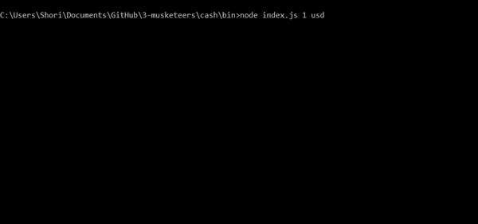

# cash

##Table of Contents

1. [Usage](#usage)
2. [Commands](#commands)
3. [Example](#example)
4. [Supported currencies](#supported-currencies)
5. [Licence](#licence)

## Presentation

### Usage
Cash is a simple script designed to convert a certain amount in a certain currency

### Commands
`--save,  -s       Save currencies as default currencies`
`--help,  -h       Display help message`
`--version,  -v     Display version number`

### Example
` $ cash 1 usd`
` $ cash 1 usd eur pln aud`
` $ cash --save usd eur pln aud`
` $ cash --help`

### Supported Currencies
*  "AUD": "Australian Dollar"
*  "RUB": "Russian Rouble"
*  "EUR": "Euro"
*  "BGN": "Bulgarian Lev"
*  "BRL": "Real Brazilian"
*  "CAD": "Canadian Dollar"
*  "CHF": "Swiss Franc"
*  "CNY": "Chinese Yuan"
*  "CZK": "Czech Koruna"
*  "DKK": "Danish Krone"
*  "GBP": "Pound Sterling"
*  "HKD": "Hong Kong Dollar"
*  "HRK": "Croatian Kuna"
*  "HUF": "Hungarian Forint"
*  "IDR": "Indonesian Rupiah"
*  "ILS": "Israeli Shekel"
*  "INR": "Indian Rupee"
*  "JPY": "Japanes Yen"
*  "KRW": "South Korean Won"
*  "MXN": "Mexican Peso"
*  "MYR": "Malaysian Ringgit"
*  "NOK": "Norwegian Krone"
*  "PHP": "Philippine Peso"
*  "PLN": "Polish Zloty"
*  "RON": "Romanian New Leu"
*  "SEK": "Swedish Krona"
*  "SGD": "Singapore Dollar"
*  "THB": "Thai Baht"
*  "TRY": "Turkish Lira"
*  "USD": "US Dollar"
*  "ZAR": "South African Rand"
*  "NZD": "New Zealand Dollar"

### Licence
none
